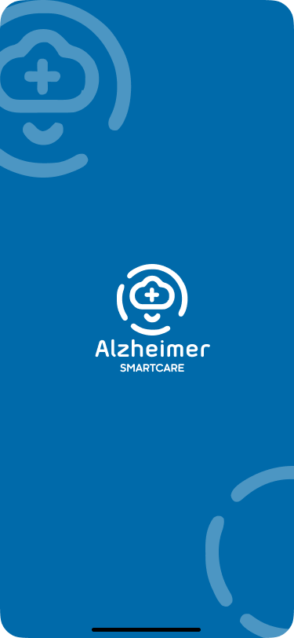
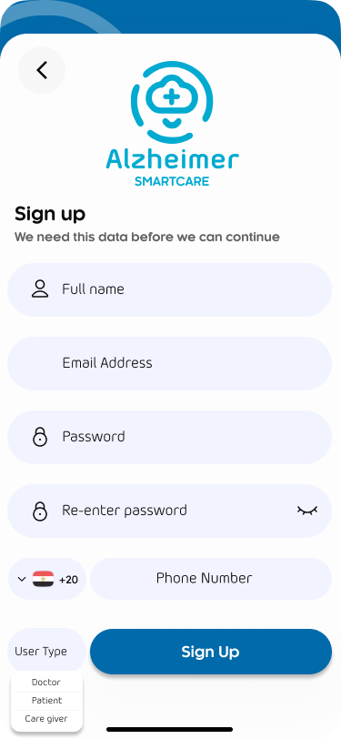

Alzheimer Smart Care 🧠📱

A comprehensive, AI-powered mobile solution designed to assist Alzheimer's patients, empower caregivers, and provide doctors with actionable health data. This project bridges the gap between medical supervision and daily care through a secure, cross-platform Flutter application.

---

## ✨ Key Features
-Multi-Role Authentication: Specialized interfaces and permissions for Doctors, Patients, and Caregivers.
-Smart Reminders: Complete CRUD functionality for medication and appointment reminders with automated notifications.
-Caregiver-Patient Pairing: Securely link accounts using unique QR code generation and scanning.
-Safety & Tracking: Real-time GPS tracking with background geolocation to ensure patient safety.
-Health Monitoring: MRI scan classification integrated via AI backends and cognitive memory games to track performance trends.
-Face Recognition: Secure patient registration and identity verification using face image storage.s

---

## 🛠 Tech Stack
-Frontend: Flutter (Dart) using GetX for State Management.
-Backend Integration: REST APIs (ASP.NET Core) and Firebase (Firestore, Auth, FCM).
-Local Database: SQLite for offline data persistence.
-AI/ML Integration: TensorFlow and OpenCV for MRI analysis and face recognition.

---

## 🔗 Backend API
Production API:
- Base API: `https://alzheimersgp.runasp.net/api/`
- Swagger: `https://alzheimersgp.runasp.net/swagger/index.html`

---

## ⚙️ API Endpoints Configuration
This app uses multiple URLs depending on the feature:

### 1) Main API (Production)
Used for auth, reminders, and face images:
- `baseUrl = https://alzheimersgp.runasp.net/api/`

### 2) Local API (Development)
For local testing:
- `testUrl = http://localhost:5267/api/`

### 3) Models Service (External)
Used for AI/model predictions:
- `modelsUrl = https://<replit-url>/`

### 4) QR Code Generator (External)
Used for generating QR codes:
- `QrCode = https://api.qrserver.com/v1/create-qr-code/?size=200x200&data=PAIRING_TOKEN`

> You can find these values in: `Endpoints` class inside the project.

---

## 📸 Screenshots
> Put screenshots under: `docs/screens/`

| Screen | Preview |
|-------|---------|
| Splash |  |
| Sign Up |  |
| Profile |  |

---

## 🚀 Getting Started

### Prerequisites
- Flutter SDK
- Android Studio / Xcode

### Run
```bash
git clone <REPO_URL>
cd Alzheimer-Smartcare
flutter pub get
flutter run
